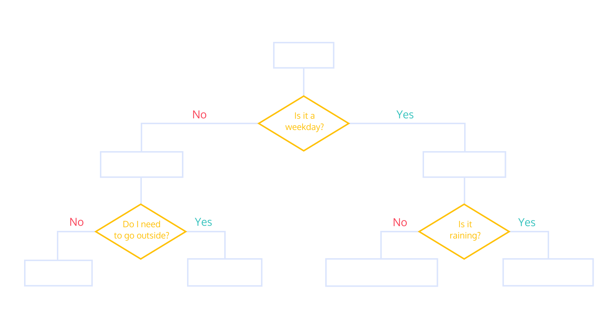

# Learn Python 3: Control Flow

## Introduction to Control Flow
Imagine waking up in the morning.

You wake up and think, “Ugh. Is it a weekday?”

If so, you have to get up and get dressed and get ready for work or school. If not, you can sleep in a bit longer and catch a couple extra Z’s. But alas, it is a weekday, so you are up and dressed and you go to look outside, “What’s the weather like? Do I need an umbrella?”

These questions and decisions control the flow of your morning, each step and result is a product of the conditions of the day and your surroundings. Your computer, just like you, goes through a similar flow every time it executes code. A program will run (wake up) and start moving through its checklists, is this condition met, is that condition met, okay let’s execute this code and return that value.

This is the control flow of your program. In Python, your script will execute from the top down, until there is nothing left to run. It is your job to include gateways, known as conditional statements, to tell the computer when it should execute certain blocks of code. If these conditions are met, then run this function.

Over the course of this lesson, you will learn how to build conditional statements using boolean expressions, and manage the control flow in your code.



## Relational Operators: Equals and Not Equals
Now that we understand what boolean expressions are, let’s learn to create them in Python. We can create a boolean expression by using relational operators.

Relational operators compare two items and return either True or False. For this reason, you will sometimes hear them called comparators.

The two relational operators we’ll cover first are:
* Equals: ==
* Not equals: !=

These operators compare two items and return True or False if they are equal or not.

We can create boolean expressions by comparing two values using these operators:
```PY
1 == 1     # True
 
2 != 4     # True
 
3 == 5     # False
 
'7' == 7   # False
```

Each of these is an example of a boolean expression.

Why is the last statement false? The '' marks in '7' make it a string, which is different from the integer value 7, so they are not equal. When using relational operators it is important to always be mindful of type.

## Boolean Variables
Before we go any further, let’s talk a little bit about True and False. You may notice that when you type them in the code editor (with uppercase T and F), they appear in a different color than variables or strings. This is because True and False are their own special type: bool.

True and False are the only bool types, and any variable that is assigned one of these values is called a boolean variable.

Boolean variables can be created in several ways. The easiest way is to simply assign True or False to a variable:
```PY
set_to_true = True
set_to_false = False
```

You can also set a variable equal to a boolean expression.
```PY
bool_one = 5 != 7 
bool_two = 1 + 1 != 2
bool_three = 3 * 3 == 9
```

These variables now contain boolean values, so when you reference them they will only return the True or False values of the expression they were assigned.
```PY
print(bool_one)    # True
 
print(bool_two)    # False
 
print(bool_three)  # True
```

## If Statement
“Okay okay okay, boolean variables, boolean expressions, blah blah blah, I thought I was learning how to build control flow into my code!”

You are, I promise you!

Understanding boolean variables and expressions is essential because they are the building blocks of conditional statements.

Recall the waking-up example from the beginning of this lesson. The decision-making process of “Is it raining? If so, bring an umbrella” is a conditional statement.

Here it is phrased in a different way:
```
If it is raining, then bring an umbrella.
```

Can you pick out the boolean expression here?

Right, "it is raining" is the boolean expression, and this conditional statement is checking to see if it is True.

If "it is raining" == True then the rest of the conditional statement will be executed and you will bring an umbrella.

This is the form of a conditional statement:
```
If [it is raining], then [bring an umbrella]
```

In Python, it looks very similar:
```PY
if is_raining:
  print("bring an umbrella")
```

You’ll notice that instead of “then” we have a colon, :. That tells the computer that what’s coming next is what should be executed if the condition is met.

Let’s take a look at another conditional statement:
```PY
if 2 == 4 - 2: 
  print("apple")
```

Will this code print apple to the terminal?

Yes, because the condition of the if statement, 2 == 4 - 2 is True.

## Relational Operators II
Now that we’ve added conditional statements to our toolkit for building control flow, let’s explore more ways to create boolean expressions. So far we know two relational operators, equals and not equals, but there are a ton (well, four) more:
* > greater than
* >= greater than or equal to
* < less than
* <= less than or equal to

Let’s say we’re running a movie streaming platform and we want to write a program that checks if our users are over 13 when showing them a PG-13 movie. We could write something like:
```PY
if age <= 13:
  print("Sorry, parental control required")
```

This function will take the user’s age and compare it to the number 13. If age is less than or equal to 13, it will print out a message.

## Boolean Operators: and
Often, the conditions you want to check in your conditional statement will require more than one boolean expression to cover. In these cases, you can build larger boolean expressions using boolean operators. These operators (also known as logical operators) combine smaller boolean expressions into larger boolean expressions.

There are three boolean operators that we will cover:
* and
* or
* not

Let’s start with and.

and combines two boolean expressions and evaluates as True if both its components are True, but False otherwise.

Consider the example:
```
Oranges are a fruit and carrots are a vegetable.
```

This boolean expression is comprised of two smaller expressions, oranges are a fruit and carrots are a vegetable, both of which are True and connected by the boolean operator and, so the entire expression is True.

Let’s look at an example of some AND statements in Python:
```PY
(1 + 1 == 2) and (2 + 2 == 4)   # True
 
(1 > 9) and (5 != 6)            # False
 
(1 + 1 == 2) and (2 < 1)        # False
 
(0 == 10) and (1 + 1 == 1)      # False
```

Notice that in the second and third examples, even though part of the expression is True, the entire expression as a whole is False because the other statement is False. The fourth statement is also False because both components are False.

## Boolean Operators: or
The boolean operator or combines two expressions into a larger expression that is True if either component is True.

Consider the statement
```
Oranges are a fruit or apples are a vegetable.
```

This statement is composed of two expressions: oranges are a fruit which is True and apples are a vegetable which is False. Because the two expressions are connected by the or operator, the entire statement is True. Only one component needs to be True for an or statement to be True.

In English, or implies that if one component is True, then the other component must be False. This is not true in Python. If an or statement has two True components, it is also True.

Let’s take a look at a couple of examples in Python:
```PY
True or (3 + 4 == 7)    # True
(1 - 1 == 0) or False   # True
(2 < 0) or True         # True
(3 == 8) or (3 > 4)     # False
```

Notice that each or statement that has at least one True component is True, but the final statement has two False components, so it is False.

## Boolean Operators: not
The final boolean operator we will cover is not. This operator is straightforward: when applied to any boolean expression it reverses the boolean value. So if we have a True statement and apply a not operator we get a False statement.
```PY
not True == False
not False == True
```

Consider the following statement:
```
Oranges are not a fruit.
```

Here, we took the True statement oranges are a fruit and added a not operator to make the False statement oranges are not a fruit.

This example in English is slightly different from the way it would appear in Python because in Python we add the not operator to the very beginning of the statement. Let’s take a look at some of those:
```PY
not 1 + 1 == 2  # False
not 7 < 0       # True
```

## Else Statements
As you can tell from your work with Calvin Coolidge’s Cool College, once you start including lots of if statements in a function the code becomes a little cluttered and clunky. Luckily, there are other tools we can use to build control flow.

else statements allow us to elegantly describe what we want our code to do when certain conditions are not met.

else statements always appear in conjunction with if statements. Consider our waking-up example to see how this works:
```PY
if weekday:
  print("wake up at 6:30")
else:
  print("sleep in")
```

In this way, we can build if statements that execute different code if conditions are or are not met. This prevents us from needing to write if statements for each possible condition, we can instead write a blanket else statement for all the times the condition is not met.

Let’s return to our if statement for our movie streaming platform. Previously, all it did was check if the user’s age was over 13 and if so, print out a message. We can use an else statement to return a message in the event the user is too young to watch the movie.
```PY
if age >= 13:
  print("Access granted.")
else:
  print("Sorry, you must be 13 or older to watch this movie.")
```

## Else If Statements
We have if statements, we have else statements, we can also have elif statements.

Now you may be asking yourself, what the heck is an elif statement? It’s exactly what it sounds like, “else if”. An elif statement checks another condition after the previous if statements conditions aren’t met.

We can use elif statements to control the order we want our program to check each of our conditional statements. First, the if statement is checked, then each elif statement is checked from top to bottom, then finally the else code is executed if none of the previous conditions have been met.

Let’s take a look at this in practice. The following if statement will display a “thank you” message after someone donates to a charity; there will be a curated message based on how much was donated.
```PY
print("Thank you for the donation!")
 
if donation >= 1000:
  print("You've achieved platinum status")
elif donation >= 500:
  print("You've achieved gold donor status")
elif donation >= 100:
  print("You've achieved silver donor status")
else:
  print("You've achieved bronze donor status")
```

Take a second to think about this function. What would happen if all of the elif statements were simply if statements? If you donated $1100.00, then the first three messages would all print because each if condition had been met.

But because we used elif statements, it checks each condition sequentially and only prints one message. If I donate $600.00, the code first checks if that is over 1000, which it is not, then it checks if it’s over 500, which it is, so it prints that message, then because all of the other statements are elif and else, none of them get checked and no more messages get printed.

Try your hand at some other elif statements.
